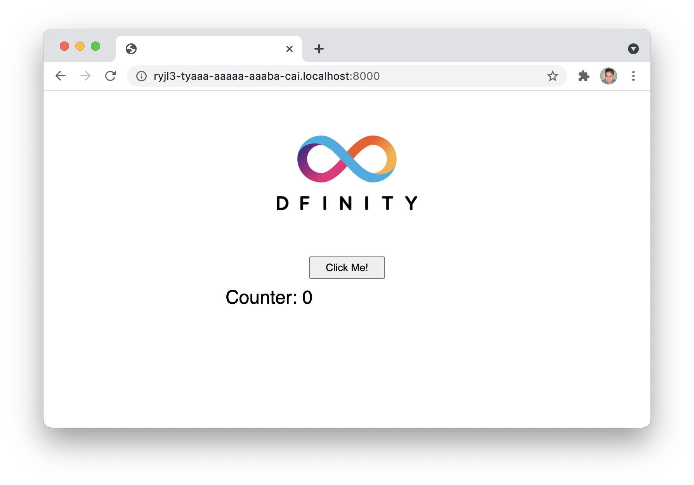

# Minimalistic Dapp
The example dapp shows how to build a very basic dapp with both backend and fronted, using Motoko for the backend functionality and plain HTML and JavaScript for the frontend. The dapp is a simple counter, which will increment a counter by clicking a button in the frontend. 

## Introduction
The purpuse of this example dapp is to show how a simple counter dapp can be implemented, with both the frontend and the backend deployed on-chain, in canisters. 

This is a high level description of the project. Describe what the project is for, what it is doing and which problem it solves. This should not be long, usually 2-3 lines is good, keep it short and precise.

Highlight some features:
- **Topic in bold**. Longer description of the topic, but keep it short.
- **Lorem ipsum dolor sit amet**. Consectetur adipiscing elit in efficitur.
- **Nulla lectus massa**. Congue ac nunc nec, bibendum hendrerit mi.
- **Pellentesque dictum**. Donec sodales ligula ac dolor vehicula, at venenatis nulla feugiat.

Duis nisl lacus, dignissim vitae lorem vel, feugiat auctor diam. Aenean elit nunc, porta nec dignissim sit amet, bibendum sed ex. Sed tincidunt erat turpis, at fringilla leo rutrum sed.
